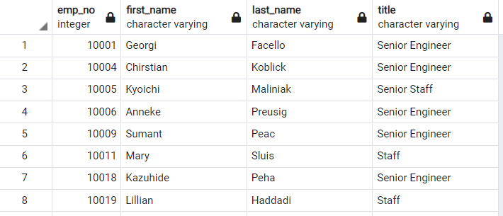
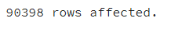
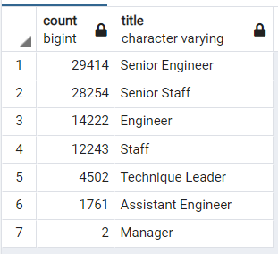
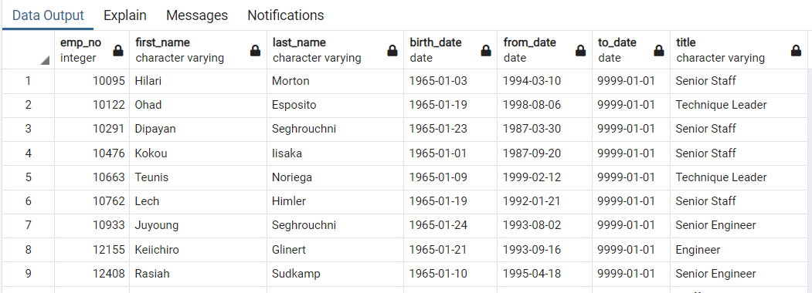
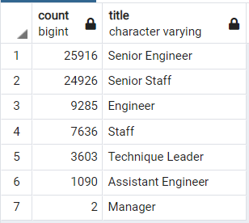
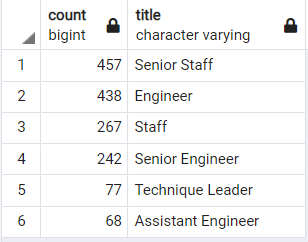

# Pewlett-Hackard-Analysis

## Overview
The purpose of this analysis is to look at retirement population and mentorship population for Pwelett Hackard employees using SQL. This is achieved by looking at employees born between 1952 and 1955. Additionally, the employee population was evaluated for employees who would be good candidates for a mentorship program. This focused on current employees born in 1965. The query code can be found here [Employee_Database_challenge](Employee_Database_challenge.sql). The results of the queries are included in the folder here: [Queries](Queries)

## Results
Based on this analysis the following information was observed:
* Over 90,000 employees are in the age range for retirement

* There are 7 employee titles in the retirement age grouping, the two with the highest number of employees are Senior Engineer and Senior Staff

* There are only 2 managers in the retirement age group
* There are 1549 employees in the mentorship age group

## Summary
1. According to this analysis 90,398 roles will need to be filled as the "Silver Tsunami" begins. However, this analysis didn't sort for current employees.

2. There are 1549 employees in the pool for mentorship. The pool of qualified, retirement-ready employees in the related departments far exceed this, and therefore there are enough employees to mentor the next generation of pewlett Hackard employees.

3. The following two tables provide more insight into the silve tsunami.
    * Filtering out the retirement data to ensure only currenly employeed people are counted and re-executing the count query provides the following table. (This reduces the total to 72,458)
    
    * Using the count function on the mentorship table better shows the break down of employees per title.
    
